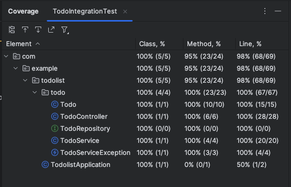

# Todolist API - Java Spring Boot

This is the first application I am creating using Spring Boot. I am recreating the backend for my Todo List project. I 
am focusing on learning Spring Boot and also on testing and TDD. The project will be tested using JUnit, and I am using 
the same MongoDB database as in the original version.

## Built with

- Java
- Spring Boot
- Gradle
- MongoDB
- JUnit and Mockito

## Installation

You will need to have MongoDB running locally at localhost:27017.

```bash
git clone https://github.com/sarahc-dev/todolist-java-spring-boot.git
```

To run the application test server:

```bash
cd todolist-java-spring-boot
./gradlew bootRun --args='--spring.profiles.active=test'
```

React frontend can be found [here](https://github.com/sarahc-dev/todolist-frontend-nextjs), and it is hosted on 
Vercel [here](https://todolist-frontend-nextjs.vercel.app/) (need to host API and MongoDB database locally).

## Process

Project set up using Spring Initializr.

I started off implementing a very simple test controller as this is the first time I am using Spring Boot to understand 
how it responds to GET requests. I then used hard-coded data and was enjoying seeing it working with my deployed 
frontend. I found implementing an API endpoint quite simple, the harder part was working out how to test it. I have been 
using both Postman and my tests to understand what the app is returning.

I tested and created each of the endpoints for my Todolist in the same structure so I can use the frontend I already 
created. Spring Boot combines the mapping and controller functionality and I have added a Service class that handles the
business logic. This structure makes more sense to me, and I have found it much easier to understand unit testing the 
controller now I am able to mock the Service class.

Connecting the Spring Boot application to MongoDB was surprisingly simple, but I have struggled to either create a test 
database or embedded database to perform some integration tests. I ended up leaving this until the end. The 
MongoRepository built-in methods for performing CRUD operations on the database were also simple but (I think) there is 
no equivalence to some Mongoose methods, for example findOneAndDelete which returns the found item. In Java, you have to 
get the item by id as a separate request to return the deleted item. I suspect this isn't a common requirement, I am 
just comparing to functionality I have in the JavaScript version, but it's not necessary for the frontend to work.

I haven't implemented the test/deleteAll route as this is not necessary as I am not going to be testing on a test 
database and so do not need an API route to deleteAll from it.

After creating all the routes, I looked into how to handle exceptions and edge cases such as the todo title being an 
empty string. I have implemented an Exception class. I wanted to be able to return both server errors and client errors
for edge cases, so I have two class initiations - one which uses a default value and one where it can be passed in as a 
parameter. Optional or default parameters for methods are not supported, so it was interesting to see how Java handles 
this case. But the event is kind of redundant in my implementation, so I think this could be improved.

I ended up doing the integration tests at the end. It was hard to find up-to-date information on using an embedded 
mongodb database (to use for tests instead of the production one) as it seems recent versions of Spring removed support 
for a commonly used version of this. Eventually I found this 
[LinkedIn post](https://www.linkedin.com/pulse/spring-boot-integration-test-in-memory-mongodb-java-server-khabale/)
which enabled me to get it working. Not without some difficulty though - it took me a while to understand the right 
combination of Annotations to get the application to run at all in the test. It also has some odd behaviour. I have
set up @BeforeEach to reset the database before each test. This does work (in that if I mark a todo as completed for 
example, this is reset in the next test), however for some inexplicable reason running this editTodo functionality 
changes the order of the items in the embedded database for the test of the GET route. It does not do this in the real 
database. Also, the tests do not run in order, so I have had to force the testing of the GET route to occur first to 
avoid this quirk.

After thinking that I did not need to implement the api/test/deleteAll because my tests here are running on a separate 
embedded database, I have since realised I do need this because it is the e2e tests that utilise this. Which brings up 
the issue that I do not want the e2e tests to delete everything from my database (or anybody who accesses that route) - 
so I do need some way of also running the application in a 'test' environment. I have implemented a 'test' profile which 
connects to a different mongodb database. I also created another controller for this route and by adding the 
@Profile("test") annotation, it's access is limited to only when running the "test" profile. Confirmed that all my e2e 
tests in the todolist frontend are still passing.

## Result

I've really enjoyed the challenges of using Spring Boot for the first time. It's not been as daunting as anticipated and
the hardest part has not been Java but the testing. I'm really happy I persevered and have a full suite of tests across
my different test files (not just the Integration test as the screenshot suggests) that I can refer back to.



## Background

The original project description and planning along with the API in Express and Node.js is 
[here](https://github.com/sarahc-dev/todolist-collection).